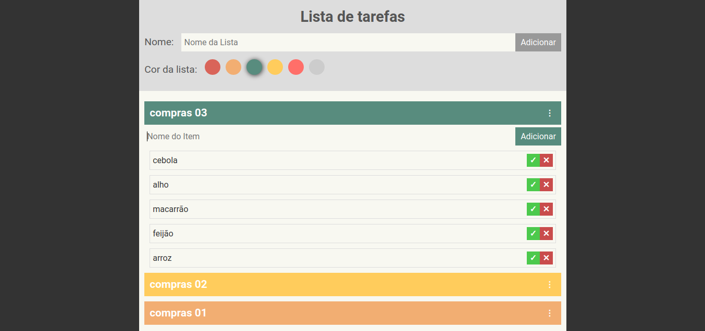

# Lista de tarefas
Este é um projeto com a finalidade de treinar habilidades relativas a linguagem **JavaScript**. O projeto consiste em uma lista de tarefas onde é possível inserir mais de uma lista e suas respectivas tarefas, que serão armazenadas localmente. Além disso, é possível adicionar uma cor de fundo ao título da lista, marcar o item como concluído e removê-lo. Qualquer sugestão de melhoria será muito bem-vinda :)

## Layout

## Linguagens
* JavaScript
* HTML
* CSS

## Executar
**Para executar este projeto na sua máquina, siga as instruções:**
* execute o seguinte comando no seu terminal: 
> $ git clone https://github.com/dhayananascimento/todolist.git
* abra a pasta que será  criada
* abra o arquivo "index.html" com o navegador de sua preferência
